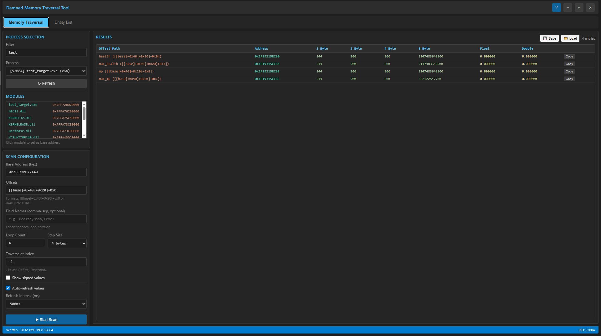
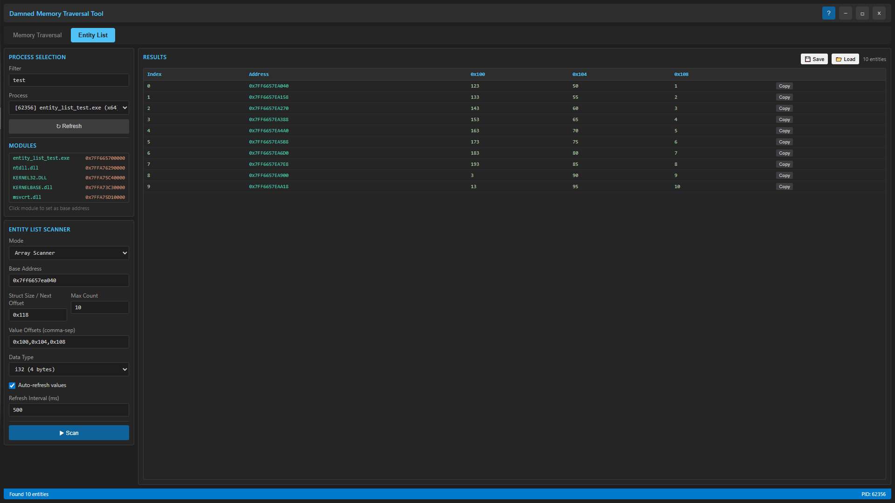

# Damned Memory Traversal Tool

A powerful Windows desktop application for memory pointer traversal and entity scanning. Built with Rust and Dioxus for a modern, responsive UI.



## Features

- **Memory Traversal**: Follow pointer chains with configurable offsets
- **Entity List Scanner**: Scan arrays, pointer tables, and linked lists
- **Real-time Value Refresh**: Auto-update values at configurable intervals
- **Value Editing**: Double-click to edit memory values directly
- **Custom Labels**: Double-click offset path to add custom labels (e.g., "Health", "Mana")
- **Save/Load Results**: Export and import scan results as JSON files
- **Multi-format Display**: View values as signed/unsigned integers, floats, doubles
- **Module Browser**: Click modules to quickly set base addresses
- **Admin Elevation**: Automatically requests administrator privileges

---

## Installation

### Prerequisites
- Windows 10/11 (x64)
- Rust toolchain (for building from source)

### Build from Source
```bash
git clone https://github.com/user/damned-memtrace.git
cd damned-memtrace
cargo build --release
```

The executable will be at `target/release/memtrace.exe`

---

## Usage

### Memory Traversal Tab


1. **Select Process**: Use the filter to find your target process
2. **Set Base Address**: Enter hex address or click a module from the list
3. **Enter Offsets**: Use bracket notation `[[[base]+0x40]+0x20]+0x0` or simple `0x40+0x20+0x0`
4. **Configure Loop**: Set count and step size to scan multiple addresses
5. **Click "Start Scan"**: Results appear in the table

#### Offset Formats
| Format | Example | Description |
|--------|---------|-------------|
| Bracket notation | `[[[base]+0x40]+0x20]+0x0` | Dereference at each bracket |
| Simple offsets | `0x40+0x20+0x0` | Add offsets sequentially |

#### Editing Values
- **Double-click** any value cell to edit
- Press **Enter** to write the new value
- Press **Escape** to cancel

#### Adding Labels
- **Double-click** the Offset Path column to add a custom label
- Labels display as `Label (offset_path)` format
- Labels are saved with scan results

#### Auto-Refresh
- Check "Auto-refresh values" to continuously update
- Set refresh interval in milliseconds (default: 500ms)

#### Save/Load Results
- Click **💾 Save** to export results to a JSON file
- Click **📂 Load** to import previously saved results
- All settings, labels, and values are preserved

---

### Entity List Tab



Scan arrays of game entities (players, items, NPCs) in memory.

#### Scan Modes

| Mode | Description | Use Case |
|------|-------------|----------|
| **Array Scanner** | Contiguous struct array | `EntityList[0], EntityList[1]...` |
| **Pointer Table** | Array of pointers to entities | `EntityPtr[0]->Entity, EntityPtr[1]->Entity...` |
| **Linked List** | Follows next pointers | `Head->Next->Next...` |

#### Configuration

| Field | Description | Example |
|-------|-------------|---------|
| Base Address | Starting address of entity list | `0x7FF6657EA040` |
| Struct Size | Size of each entity (Array mode) | `0x118` |
| Max Count | Maximum entities to scan | `100` |
| Value Offsets | Comma-separated offsets to read | `0x100,0x104,0x108` |
| Data Type | Type of values at offsets | `i32`, `f32`, etc. |

#### Data Types
- `i8` / `i16` / `i32` / `i64` - Signed integers
- `f32` - Float (32-bit)
- `f64` - Double (64-bit)

#### Auto-Refresh & Save/Load
- Check "Auto-refresh values" to continuously update entity values
- Click **💾 Save** / **📂 Load** to export/import entity scan results

#### Example: Scanning Player Array
```
Mode: Array Scanner
Base: 0x7FF6657EA040
Struct Size: 0x118
Max Count: 10
Value Offsets: 0x100,0x104,0x108
Data Type: i32
```

This reads HP, MP, and Level from 10 player entities.

---

## Test Target

A C++ test target is included for testing:

```bash
cd test_target
g++ -o entity_list_test.exe entity_list_test.cpp -std=c++17
.\entity_list_test.exe
```

The test target creates:
- Array of 10 entities
- Pointer table with 10 entries (some null)
- Linked list with 5 nodes

---

## Keyboard Shortcuts

| Key | Action |
|-----|--------|
| Enter | Confirm edit |
| Escape | Cancel edit |

---

## Technical Details

- **Framework**: Dioxus 0.6 (Rust)
- **Platform**: Windows (uses Windows API for memory access)
- **Architecture**: x64

### Project Structure
```
damned-memtrace/
├── crates/
│   ├── memlib/      # Memory reading/writing library
│   ├── ui/          # Dioxus UI components
│   └── memtrace/    # Main application
├── assets/          # Images and resources
└── test_target/     # C++ test application
```

---

## License

MIT License

---

## Contributing

1. Fork the repository
2. Create a feature branch
3. Submit a pull request

---

## Disclaimer

This tool is intended for educational purposes and legitimate software development/debugging. Use responsibly and only on processes you have permission to access.
